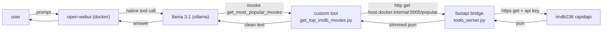

# llama imdb agent — local tool-calling pipeline

a local, self-hosted pipeline that lets a local llm (llama 3.1, served by ollama) fetch **live imdb data** through a custom open-webui tool. the model calls a python tool, the tool hits a lightweight fastapi bridge running on the host, and the bridge pulls real-time "most popular movies" from the imdb236 rapidapi endpoint.

everything runs locally. no cloud llm, no data leaving the machine except the outbound rapidapi request.

---

## overview

the system answers natural-language movie questions (e.g. *"what are the top 5 popular movies right now?"*) with **real, current data** instead of the model's stale training knowledge. it does this by giving the llm a callable tool via open-webui's native function-calling mechanism.



---

## components

### 1. fastapi bridge — `tools_server.py`

a minimal fastapi service that runs on the host at `http://0.0.0.0:5005`. it exposes a single route, `/popular`, which:

- performs an authenticated https `get` to the imdb236 rapidapi `most-popular-movies` route
- **slims** each record down to the fields the model actually needs (`primaryTitle`, `startYear`, `averageRating`, `genres`) to keep the payload small and token-efficient
- returns the top 5 results as clean json, with graceful error handling for timeouts, non-200 responses, and upstream failures

binding to `0.0.0.0` (not `127.0.0.1`) is intentional — it makes the service reachable from inside the open-webui container via `host.docker.internal`.

### 2. open-webui custom tool — `get_top_imdb_movies.py`

a python tool imported into open-webui and attached to the model. key design points:

- **no required arguments** — the function takes no llm-supplied parameters, which prevents the model from having to invent values (a common cause of skipped or hallucinated tool calls)
- **`valves`** — configurable `server_url`, `max_movies`, and `timeout` exposed in the open-webui ui, so the endpoint can be changed without editing code
- **human-readable output** — the tool parses the json and returns a clean, numbered list rather than raw or truncated json, which keeps the model's answer accurate
- **defensive error handling** — connection, status, and parse failures return explicit messages instead of failing silently

### 3. open-webui + ollama

open-webui (v0.10.1, docker) hosts the chat ui and the tool registry. ollama serves llama 3.1 locally. the model must be configured with **function calling: native** so it emits real structured tool calls through ollama's tool api instead of writing pseudo-code.

---

## how it works (request flow)

1. the user asks a movie question in open-webui.
2. open-webui passes the prompt to llama 3.1 with the tool schema attached (native mode).
3. the model emits a structured call to `get_most_popular_movies`.
4. the tool sends `get http://host.docker.internal:5005/popular` to the host bridge.
5. the bridge calls imdb236 rapidapi, slims the response, and returns json.
6. the tool formats the json into readable text and hands it back to the model.
7. the model composes the final natural-language answer for the user.

---

## prerequisites

- windows with docker desktop (provides `host.docker.internal`)
- python 3.11+ and a virtual environment on the host
- ollama with a tool-capable `llama3.1` model pulled
- open-webui running in docker
- a rapidapi account subscribed to the imdb236 api

---

## setup

### 1. host bridge

```powershell
python -m venv venv
venv\Scripts\activate
pip install fastapi uvicorn requests
python tools_server.py
```

the server starts on `http://0.0.0.0:5005`. verify in a browser: `http://localhost:5005/popular` should return json.

### 2. windows firewall (container → host)

open-webui runs in docker and reaches the host through `host.docker.internal`. windows firewall blocks that virtual adapter by default, causing silent timeouts. allow the port once (run powershell **as administrator**):

```powershell
New-NetFirewallRule -DisplayName "OpenWebUI Bridge 5005" -Direction Inbound -LocalPort 5005 -Protocol TCP -Action Allow
```

verify from inside the container:

```powershell
docker exec -it open-webui curl http://host.docker.internal:5005/popular
```

### 3. open-webui tool + model

1. **workspace → tools** → import `get_top_imdb_movies.py` → save.
2. **workspace → models → (your model) → edit** → under **tools**, check the imdb tool.
3. expand **advanced params** → set **function calling → native** → save.
4. start a new chat and ask a movie question.

---

## usage

ask the agent:

> use the get_most_popular_movies tool to fetch the top 5 popular movies

the model calls the tool and responds with a numbered list of current titles, years, ratings, and genres pulled live from imdb.

---

## screenshots

> images are added in the repository. captions describe each stage of the running pipeline.

### fastapi bridge running in the terminal

the local server started with `python tools_server.py`, listening on port 5005 and logging incoming requests.


### live api response from localhost

the `/popular` endpoint returning slimmed json when accessed directly via `http://localhost:5005/popular` in the browser.


### question and answer in the open-webui chat

the llama 3.1 agent invoking the tool and returning the top popular movies with real-time data.


### knowledge base in open-webui

the open-webui knowledge base configured for the agent.


### imdb236 endpoint on rapidapi

the upstream imdb236 `most-popular-movies` endpoint on the rapidapi dashboard.


---

## project structure

```
.
├── tools_server.py            # fastapi bridge: host service that calls rapidapi
├── get_top_imdb_movies.py     # open-webui custom tool imported into the ui
├── README.md
└── assets/
    └── screenshots/           # images referenced above
```

---

## troubleshooting

- **model writes example python instead of calling the tool** → function calling is on **default**; switch it to **native** and open a new chat.
- **"i don't have permission" / hallucinated function name** → the tool isn't attached to the model; check it under **workspace → models → tools**.
- **silent timeout from the container** → windows firewall is blocking port 5005; add the inbound rule above.
- **`getaddrinfo failed` for the rapidapi host** → transient host dns failure; retry, and confirm the host has outbound internet.
- **connection refused** → the bridge isn't running or is bound to `127.0.0.1` instead of `0.0.0.0`.

---

## security note

the rapidapi key is currently hardcoded in `tools_server.py`. **before pushing to a public github repository**, move it to an environment variable and load it at runtime, and add the secret to `.gitignore`. rotate the key if it has already been committed.

```python
import os
"x-rapidapi-key": os.environ["RAPIDAPI_KEY"],
```

---

## license

mit
